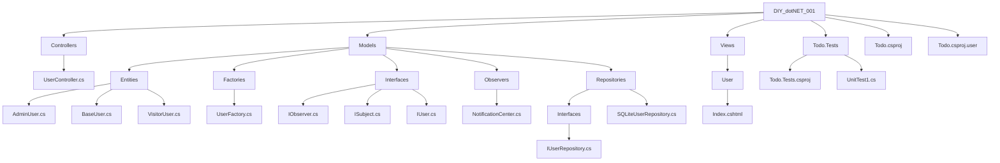

## 🇫🇷 Fonctionnalités clés et apprentissages

Ce projet m’a permis de découvrir les **principes fondamentaux de la POO** et d’appliquer plusieurs **Design Patterns** :
- Pattern **Factory** pour créer dynamiquement différents types d’utilisateurs
- Pattern **Observer** pour gérer un système de notifications réactif
- Pattern **Repository** pour abstraire l’accès aux données
- **Tests unitaires** avec xUnit pour valider le comportement du code
- Intégration de **Entity Framework** et génération de **CRUD** avec scaffolding
- Utilisation de **JavaScript dynamique** (checkbox, interactions côté client)
- Résolution de bugs réels : erreurs de **routage (404)**, conflits de vues (`_Form.cshtml`)
- Compréhension des **vues partagées**, bien qu'encore en cours d’apprentissage
- Amélioration de la gestion des **ID et routes** dans le modèle MVC

---
---

## 🇬🇧 Key Features & Learnings

This project helped me explore the **fundamentals of OOP** while applying multiple **Design Patterns**:
- **Factory Pattern** to dynamically create various user types
- **Observer Pattern** for reactive notification handling
- **Repository Pattern** to abstract and manage data access
- **Unit testing** with xUnit to ensure code reliability
- Integration of **Entity Framework** and **CRUD scaffolding**
- Use of **dynamic JavaScript** (checkboxes, frontend logic)
- Debugging real-world issues like **routing errors (404)** and view problems (`_Form.cshtml`)
- Initial implementation of **shared views**, with ongoing refinement
- Improved handling of **IDs and routing** in an MVC architecture

# Flowchart


# 🧪 Lancer les tests / Run the Tests
```bash
cd Todo.Tests
dotnet test
```
